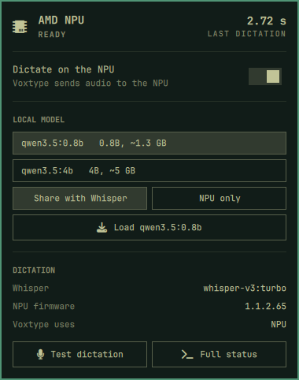
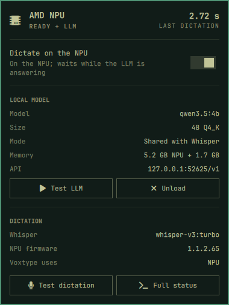
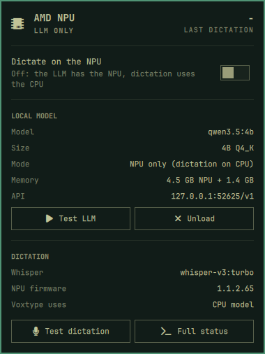

# AMD NPU for Omarchy: dictation and local models

Put the **AMD XDNA2 NPU** in Ryzen AI laptops to work on Omarchy:

- **Dictation.** Omarchy's Voxtype sends your voice to Whisper large-v3-turbo running on the NPU,
  instead of a small model on the CPU.
- **Small local LLMs.** Load models like Qwen3.5 or Gemma 4 on the NPU, either next to Whisper or with
  the NPU to themselves. Use them from other apps (OpenAI and Ollama APIs) or a terminal chat.
- **A bar card** in the style of Omarchy's own panels shows what's running and lets you switch.

Everything runs on [FastFlowLM](https://github.com/FastFlowLM/FastFlowLM). The CPU and iGPU stay free,
so a big model in LM Studio on the GPU keeps its speed while the NPU works.

## Measured on a ROG Flow Z13 (Ryzen AI MAX+ 395, Omarchy 4)

**Dictation**

| | |
|---|---|
| Dictation (hold F9, speak, release) | ~2.7 s from release to typed text |
| 3 min 19 s recording | transcribed in 34.9 s (**5.7× faster than real time**) |
| CPU / GPU while transcribing | 1–2% / 1% |
| LLM on the GPU (Gemma 4 26B-A4B) while the NPU transcribes | 57.2 → 56.1 tok/s (−2%) |

**Local models on the NPU**

| Model | Generation | Load | Memory (NPU + process) |
|---|---|---|---|
| `qwen3.5:0.8b` | **44.7 tok/s** | 1.9 s | ~2.0 GB |
| `qwen3.5:4b` | **15.2 tok/s** | 3.3 s | ~6.1 GB |
| Whisper alone | — | — | ~1.0 GB |

## Requirements

- **An AMD XDNA2 NPU:** Ryzen AI 300 (Strix Point), Ryzen AI MAX (Strix Halo), Krackan Point or
  Gorgon Point. Older XDNA1 NPUs (Phoenix, Hawk Point) aren't supported by FastFlowLM, and
  `amd-npu check` says so.
- **Omarchy (Arch)** with a kernel that has the in-tree `amdxdna` driver (6.14+) and NPU firmware
  ≥ 1.1.0.0 (from `linux-firmware-other`).
- **Voxtype**, for dictation: `omarchy voxtype install`.

**Tested so far on one machine only: ROG Flow Z13 GZ302EA.** Reports from other XDNA2 laptops are
welcome.

## Install

```bash
# 1. The bar card (an Omarchy shell plugin; lands disabled so you can review it)
omarchy plugin add https://github.com/AlanRoman117/omarchy-amd-npu.git --enable

# 2. The NPU runtime (sudo), then reboot
~/.config/omarchy/plugins/alanroman117.amd-npu/bin/amd-npu install

# 3. After the reboot: download Whisper, start the NPU server, point Voxtype at it
~/.config/omarchy/plugins/alanroman117.amd-npu/bin/amd-npu enable
```

Then **hold F9** (or **Super + Ctrl + X**) to dictate, as usual. Tip: add the CLI to your path with
`ln -s ~/.config/omarchy/plugins/alanroman117.amd-npu/bin/amd-npu ~/.local/bin/`.

Omarchy's plugin installer never runs code or sudo, which is why steps 2 and 3 are separate
commands you run yourself.

## Local models

```bash
amd-npu models                 # NPU models FastFlowLM offers, and which you've downloaded
amd-npu pull qwen3.5:4b        # download one (asks first; ~3 GB on disk for 4B)
amd-npu load qwen3.5:4b        # load it next to Whisper
amd-npu chat                   # talk to it in the terminal
amd-npu unload                 # back to Whisper only
```

**Two ways to load:**

| | Share with Whisper (default) | NPU only (`--exclusive`) |
|---|---|---|
| Dictation | Keeps working on the NPU | Falls back to Voxtype's CPU model (lower accuracy) |
| Catch | **Dictation waits while the model is answering.** The server runs one request at a time. | You're asked to confirm, and notified when dictation moves to the CPU and back |
| Unload | Back to Whisper only | Whisper returns and dictation moves back to the NPU |

While a model is loaded, other apps can use it at `http://127.0.0.1:52625/v1` (OpenAI API, model name
as shown by `amd-npu models`) or `http://127.0.0.1:52625/api` (Ollama API). In share mode, a long
answer holds up dictation, so keep heavy API use to NPU-only sessions.

Downloads are always a deliberate `amd-npu pull`. The card and `load` only offer models you've already
downloaded. (FastFlowLM's server downloads any model a request names, so arbitrary names are refused.)

## The bar card

A chip icon on the right of the bar: bright when the NPU server is up, dimmed when it's stopped,
hidden when it isn't set up. Click it for a card in the style of Omarchy's Wi-Fi, Bluetooth and
power panels:

| Whisper only | Sharing with an LLM | LLM on the NPU alone |
|:---:|:---:|:---:|
|  |  |  |

- **Header:** READY, READY + LLM, LLM ONLY, LOCAL MODEL (Voxtype on its CPU model) or STOPPED, plus
  your last dictation time.
- **Dictate on the NPU:** a switch. In NPU-only mode, switching it on moves the model to share mode
  and brings Whisper back.
- **Local model:** when loaded, its name, size, mode, memory (NPU buffers + process) and API address,
  with **Test LLM** (generation speed) and **Unload**. When nothing is loaded, your downloaded models,
  a Share / NPU only choice, and **Load** (NPU only asks you to confirm first).
- **Dictation:** Whisper model, NPU firmware, where Voxtype sends audio, **Test dictation** and
  **Full status**.

Recording and transcribing are already shown by Omarchy's built-in dictation indicator, so the card
doesn't repeat them.

## Commands

| Command | What it does |
|---|---|
| `amd-npu check` | Is this machine supported, and what's installed? |
| `amd-npu install` | Installs `xrt`, `xrt-plugin-amdxdna` and `fastflowlm`, and lifts the memlock limit for your user session (sudo; reboot after) |
| `amd-npu enable` | Downloads Whisper (620 MB), starts `amd-npu.service`, switches Voxtype to it (config backed up). Safe to re-run; migrates the older `flm-asr.service`. |
| `amd-npu status [--json]` | Server, Whisper, firmware, Voxtype backend, last dictation, loaded model, memory |
| `amd-npu doctor` | `status` plus a live transcription request |
| `amd-npu ping` | Quiet Whisper check: `ok <seconds>` or `fail <reason>` |
| `amd-npu models [--json]` | NPU LLMs FastFlowLM offers, with size, memory and download state |
| `amd-npu pull <model>` | Download a model (asks first) |
| `amd-npu load <model> [--exclusive] [--ctx N]` | Load next to Whisper, or alone with dictation on the CPU |
| `amd-npu unload` | Drop the model; Whisper only, dictation back on the NPU |
| `amd-npu chat [model] [--think]` | Streaming terminal chat (`/reset`, `/exit`, Ctrl+C stops an answer) |
| `amd-npu bench-llm [--raw]` | Measure the loaded model's generation speed |
| `amd-npu disable` | Voxtype back to its CPU model; stop the server (frees the NPU) |
| `amd-npu remove` | `disable` + delete the service; asks before deleting models, settings, packages and memlock settings |

## What it changes on your system

- **Packages:** `xrt`, `xrt-plugin-amdxdna`, `fastflowlm` (all from Arch `extra`).
- **Memlock:** the NPU runtime needs unlimited locked memory. This is scoped to your user session:
  - `/etc/systemd/system/user@.service.d/90-amd-npu-memlock.conf`
  - `/etc/systemd/user.conf.d/90-amd-npu-memlock.conf`
  - `/etc/security/limits.d/90-amd-npu-memlock.conf`
- **Service:** `~/.config/systemd/user/amd-npu.service` (`flm serve` on `127.0.0.1:52625`), with its
  settings in `~/.config/amd-npu/server.env` (which model, Whisper on or off, context length).
- **Models:** `~/.config/flm/models/`.
- **Voxtype config:** in `~/.config/voxtype/config.toml`, `[whisper]` gets `backend = "remote"` and
  `remote_endpoint = "http://127.0.0.1:52625"`. The endpoint has no `/v1`; Voxtype adds it. NPU-only
  mode sets `backend = "local"` until you unload.

## Good to know

- **The NPU server holds the NPU exclusively.** Other NPU tools (`flm run`, Lemonade) need
  `amd-npu disable` first.
- **If the server is stopped, dictation fails** until it's started again, or you run `amd-npu disable`,
  which puts Voxtype back on its CPU model.
- **Don't force NPU firmware versions or install `amdxdna-dkms`** on a current kernel. A mismatch can
  make the NPU disappear.
- The server listens only on `127.0.0.1`.

## Uninstall

```bash
~/.config/omarchy/plugins/alanroman117.amd-npu/bin/amd-npu remove
omarchy plugin remove alanroman117.amd-npu
```

## Licences

This repo is MIT. FastFlowLM's orchestration code is MIT, and its NPU kernels ship under
FastFlowLM's own free-to-use binary licence (installed from Arch's `extra` repo, not bundled here).
Models keep their own licences (Whisper: MIT; Qwen, Gemma and others: see each model card).
