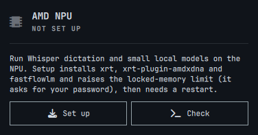

# AMD NPU for Omarchy: dictation and local models

Put the **AMD XDNA2 NPU** in Ryzen AI laptops to work on Omarchy:

- **Dictation.** Omarchy's Voxtype sends your voice to Whisper large-v3-turbo running on the NPU,
  instead of a small model on the CPU.
- **Small local LLMs.** Load models like Qwen3.5 or Gemma 4 on the NPU, either next to Whisper or with
  the NPU to themselves. Use them from other apps (OpenAI and Ollama APIs) or a terminal chat.
- **A bar card** in the style of Omarchy's own panels shows what's running and lets you switch.

Everything runs on [FastFlowLM](https://github.com/FastFlowLM/FastFlowLM). The CPU and iGPU stay free,
so a big model in LM Studio on the GPU keeps its speed while the NPU works.

## Measured on a ROG Flow Z13 (Ryzen AI MAX+ 395, Omarchy 4)

**Dictation**

| | |
|---|---|
| Dictation (hold F9, speak, release) | ~2.7 s from release to typed text |
| 3 min 19 s recording | transcribed in 34.9 s (**5.7× faster than real time**) |
| CPU / GPU while transcribing | 1–2% / 1% |
| LLM on the GPU (Gemma 4 26B-A4B) while the NPU transcribes | 57.2 → 56.1 tok/s (−2%) |

**Local models on the NPU**

| Model | Generation | Load | Memory (NPU + process) |
|---|---|---|---|
| `qwen3.5:0.8b` | **44.7 tok/s** | 1.9 s | ~2.0 GB |
| `qwen3.5:4b` | **15.2 tok/s** | 3.3 s | ~6.1 GB |
| Whisper alone | — | — | ~1.0 GB |

## Requirements

- **An AMD XDNA2 NPU:** Ryzen AI 300 (Strix Point), Ryzen AI MAX (Strix Halo), Krackan Point or
  Gorgon Point. Older XDNA1 NPUs (Phoenix, Hawk Point) aren't supported by FastFlowLM, and
  `amd-npu check` says so.
- **Omarchy (Arch)** with a kernel that has the in-tree `amdxdna` driver (6.14+) and NPU firmware
  ≥ 1.1.0.0 (from `linux-firmware-other`).
- **Voxtype**, for dictation: `omarchy voxtype install`.

**Tested so far on one machine only: ROG Flow Z13 GZ302EA.** Reports from other XDNA2 laptops are
welcome.

## Install

```bash
omarchy plugin add https://github.com/AlanRoman117/omarchy-amd-npu.git --enable
```

Then click the dimmed chip in the bar. The card walks you through setup:



1. **Set up** opens a terminal that installs the NPU runtime (it asks for your password).
2. **Restart** the computer.
3. **Finish setup** downloads Whisper, starts the NPU server and points Voxtype at it.

On a machine without an XDNA2 NPU the chip stays hidden. Prefer the terminal? The same steps are
`amd-npu install`, a reboot, then `amd-npu enable`, run from
`~/.config/omarchy/plugins/alanroman117.amd-npu/bin/`.

Then **hold F9** (or **Super + Ctrl + X**) to dictate, as usual. Voxtype stops recording after 60 s by
default (Omarchy's setting). For longer dictation, raise `max_duration_secs` in
`~/.config/voxtype/config.toml` (e.g. `300`) and run `systemctl --user restart voxtype`. The NPU
transcribes a minute of speech in about 9 s, and `amd-npu` gives Voxtype a 180 s timeout. Tip: add the CLI to your path with
`ln -s ~/.config/omarchy/plugins/alanroman117.amd-npu/bin/amd-npu ~/.local/bin/`.

Omarchy's plugin installer never runs code or sudo, which is why setup is a separate step you
start yourself.

To update: `omarchy plugin update alanroman117.amd-npu`, then run `amd-npu enable` again so the
service files and the API proxy are refreshed (a changed unit's previous version is kept as one
backup).

## Local models

```bash
amd-npu models                 # NPU models FastFlowLM offers, and which you've downloaded
amd-npu pull qwen3.5:4b        # download one (asks first; ~3 GB on disk for 4B)
amd-npu load qwen3.5:4b        # load it next to Whisper
amd-npu chat                   # talk to it in the terminal
amd-npu unload                 # back to Whisper only
```

**Two ways to load:**

| | Share with Whisper (default) | NPU only (`--exclusive`) |
|---|---|---|
| Dictation | Keeps working on the NPU | Falls back to Voxtype's CPU model (lower accuracy) |
| Catch | **Dictation waits while the model is answering.** The server runs one request at a time. | You're asked to confirm, and notified when dictation moves to the CPU and back |
| Unload | Back to Whisper only | Whisper returns and dictation moves back to the NPU |

While a model is loaded, other apps can use it at `http://127.0.0.1:52625/v1` (OpenAI API, model name
as shown by `amd-npu models`) or `http://127.0.0.1:52625/api` (Ollama API). In share mode, a long
answer holds up dictation, so keep heavy API use to NPU-only sessions.

Downloads are always a deliberate `amd-npu pull`. The card and `load` only offer models you've already
downloaded. (FastFlowLM's server downloads any model a request names, so arbitrary names are refused.)

## The bar card

A chip icon on the right of the bar: bright when the NPU server is up, dimmed when it's stopped,
hidden when it isn't set up. Click it for a card in the style of Omarchy's Wi-Fi, Bluetooth and
power panels:

| Whisper only | Sharing with an LLM | LLM on the NPU alone |
|:---:|:---:|:---:|
|  |  |  |

- **Header:** READY, READY + LLM, LLM ONLY, LOCAL MODEL (Voxtype on its CPU model) or STOPPED, plus
  your last dictation time.
- **Dictate on the NPU:** a switch. In NPU-only mode, switching it on moves the model to share mode
  and brings Whisper back.
- **Local model:** when loaded, its name, size, mode, memory (NPU buffers + process) and API address,
  with **Test LLM** (generation speed), **Chat** and **Unload**. When nothing is loaded, your downloaded models,
  a Share / NPU only choice, and **Load** (NPU only asks you to confirm first).
- **Dictation:** Whisper model, NPU firmware, where Voxtype sends audio, **which microphone** it's
  recording from (red with "(muted)" if that input is muted), **Test dictation** and **Full status**.
  With more than one input, pick one from the list. That sets the system default input, the same as
  Omarchy's audio panel, and Voxtype uses it from the next dictation. The laptop's own mic is labelled
  "Built-in mic". If Voxtype's config locks dictation to one device (`[audio] device`), the card shows
  that device instead of the list.

**Chat** opens a floating terminal with `amd-npu chat` for a quick question or a short summary:
paste the text (newlines and all, it goes as one message) and ask. `/exit` or Ctrl+D closes the
window. It's a local terminal client, so the browser protection below stays as it is. To open it
from a key, bind `omarchy-shell alanroman117.amd-npu chat`.

**While you hold F9**, a countdown shows how long you can keep talking before Voxtype's recording
limit (`max_duration_secs`):
- **On-screen overlay:** the microphone's name on top, then a mic icon, a bar that drains, and
  "4:37 left". The name follows the mic live: unplug a headset mid-sentence and it switches to the
  mic PipeWire moved the recording to. If the mic sends no sound for 3 seconds (switched off, boom
  muted, or a headset still reconnecting after you plug it in), the name turns red and adds
  "- no sound", clearing as soon as sound arrives. Change the delay, or turn it off, under
  **Warn on silence** on the card (Off / 3 s / 5 s / 10 s; kept in `~/.config/amd-npu/card.json`).
  It's only a hint: the recording keeps going. In the last 15 seconds it reads "0:12 left - finishing soon".
- **The chip in the bar** turns into the time, and switches to the warning colour near the end.
- **After you let go,** the overlay says "Transcribing..." until the text arrives.

The countdown places itself just above Voxtype's waveform, wherever Voxtype's `[osd]` settings put
it (below it if the waveform is near the top, Omarchy's usual overlay spot if it's in a corner), so
nothing needs moving. With more than one monitor it shows on the focused one, like the waveform.

Recording and transcribing states are also shown by Omarchy's built-in dictation indicator.

## Commands

| Command | What it does |
|---|---|
| `amd-npu check` | Is this machine supported, and what's installed? |
| `amd-npu setup-state` | One word for the bar card: `unsupported`, `driver`, `install`, `reboot`, `enable` or `installed` |
| `amd-npu install` | Installs `xrt`, `xrt-plugin-amdxdna` and `fastflowlm`, and lifts the memlock limit for your user session (sudo; reboot after) |
| `amd-npu enable` | Downloads Whisper (620 MB), starts `amd-npu.service`, switches Voxtype to it (config backed up). Safe to re-run; migrates the older `flm-asr.service`. |
| `amd-npu status [--json]` | Server, Whisper, firmware, Voxtype backend, last dictation, loaded model, memory |
| `amd-npu doctor` | `status`, browser-protection checks, and a live transcription request |
| `amd-npu ping` | Quiet Whisper check: `ok <seconds>` or `fail <reason>` |
| `amd-npu models [--json]` | NPU LLMs FastFlowLM offers, with size, memory and download state |
| `amd-npu pull <model>` | Download a model (asks first) |
| `amd-npu load <model> [--exclusive] [--ctx N]` | Load next to Whisper, or alone with dictation on the CPU. `--ctx` is `-1` (model default) or 512 and up; if the server won't start, the previous settings are restored |
| `amd-npu unload` | Drop the model; Whisper only, dictation back on the NPU |
| `amd-npu chat [model] [--think]` | Streaming terminal chat; a multi-line paste is one message (`/reset`, `/exit`, Ctrl+C stops an answer) |
| `amd-npu bench-llm [--raw]` | Measure the loaded model's generation speed |
| `amd-npu disable` | Voxtype back to its CPU model; stop the server (frees the NPU) |
| `amd-npu remove` | `disable` + delete the service; asks before deleting models, settings, packages and memlock settings |

## What it changes on your system

- **Packages:** `xrt`, `xrt-plugin-amdxdna`, `fastflowlm` (all from Arch `extra`).
- **Memlock:** the NPU runtime needs unlimited locked memory. This is scoped to your user session:
  - `/etc/systemd/system/user@.service.d/90-amd-npu-memlock.conf`
  - `/etc/systemd/user.conf.d/90-amd-npu-memlock.conf`
  - `/etc/security/limits.d/90-amd-npu-memlock.conf`
- **Services:** `~/.config/systemd/user/amd-npu.service` (FastFlowLM on `127.0.0.1:6669`, sandboxed
  so it can't write the models folder) and `amd-npu-proxy.service` (the API on `127.0.0.1:52625`,
  running `~/.local/share/amd-npu/proxy.py`). Settings live in `~/.config/amd-npu/server.env`
  (which model, Whisper on or off, context length, allowed browser origins).
- **Models:** `~/.config/flm/models/`.
- **Voxtype config:** in `~/.config/voxtype/config.toml`, `[whisper]` gets `backend = "remote"` and
  `remote_endpoint = "http://127.0.0.1:52625"` (plus `remote_model` and a 180 s `remote_timeout_secs`). The endpoint has no `/v1`; Voxtype adds it. NPU-only
  mode sets `backend = "local"` until you unload.

## Good to know

- **The NPU server holds the NPU exclusively.** Other NPU tools (`flm run`, Lemonade) need
  `amd-npu disable` first.
- **If the server is stopped, dictation fails** until it's started again, or you run `amd-npu disable`,
  which puts Voxtype back on its CPU model.
- **Plugging a mic in mid-dictation can leave that dictation silent.** Unplugging is fine: PipeWire
  moves the recording to the next mic and it carries on. But when a mic is plugged in (or a wireless
  headset's receiver goes back in), PipeWire makes it the default and moves the live recording onto
  it, and on that moved recording some devices send only silence. The countdown shows
  "- no sound"; let go of F9 and press it again, and the new dictation uses the mic normally. This
  plugin leaves PipeWire's device switching alone rather than change system behaviour.
- **Don't force NPU firmware versions or install `amdxdna-dkms`** on a current kernel. A mismatch can
  make the NPU disappear.
- **The API on `127.0.0.1:52625` has no password.** Programs on this machine, under any user, can
  use it. That's fine on a single-user laptop. On a shared machine, another account could also take
  the port while the service is stopped.
- **Web pages can't use it.** FastFlowLM itself listens on `127.0.0.1:6669`, a port browsers refuse
  to connect to. The proxy on 52625 refuses requests from web pages (any origin not on your
  allowlist), plain-text tricks, unexpected `Host` headers (DNS rebinding) and models that aren't
  downloaded. It also strips FastFlowLM's "readable by any site" CORS header. `amd-npu doctor` checks
  this. To let a browser-based chat UI in, list its origin in `~/.config/amd-npu/server.env`, e.g.
  `AMD_NPU_ALLOWED_ORIGINS=http://localhost:8080`, then run `systemctl --user restart amd-npu`.
- **Requests can't download models.** The server can read the models folder but not write it, so
  downloads only happen through `amd-npu pull`. A program that calls FastFlowLM's port directly
  with a missing model makes it hang instead (a FastFlowLM 1.0.4 bug); `systemctl --user restart
  amd-npu` recovers.

## Uninstall

```bash
~/.config/omarchy/plugins/alanroman117.amd-npu/bin/amd-npu remove
omarchy plugin remove alanroman117.amd-npu
```

## Licences

This repo is MIT. FastFlowLM's orchestration code is MIT, and its NPU kernels ship under
FastFlowLM's own free-to-use binary licence (installed from Arch's `extra` repo, not bundled here).
Models keep their own licences (Whisper: MIT; Qwen, Gemma and others: see each model card).
